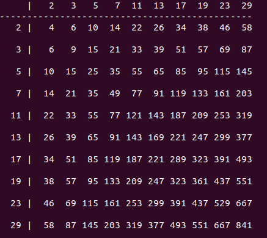

# multiplication-table-of-primes

### Introduction
This repository contains code which can generate multiplication table of first N prime numbers. The solution follows **TDD** approach. All the tests are inside the **tests** directory and the main classes are in **src** directory. 

```src/PrimeNumberGenerator.php``` contains two functions - a ```public function getPrimeNumbers(int $n)``` to return first N primes and a ```private function isPrime($num)``` which checks whether given number is prime or not. For each number algorithm checks if it is divisible by any number starting from 2 to sqrt(n).

```src/MultiplicationTableGenerator.php``` contains a ```public function getMultiplicationTable(array $primes)``` which takes array of first N primes as input and returns a multiplication table for them.

Interface ```src/IDisplay.php``` declares one ```function display(array $table)``` which has to be implemented by any class implements this interface. ```src/GraphicalDisplay.php``` implements this behaviour and has its own implementation to format table. ```src/SimpleDisplay.php``` is another implementation which is simplest of its kind and just prints the multiplication table in plain text without any formatting.

### How to run
Code uses [composer](https://getcomposer.org) for dependency management. Use follwing steps to run the programme:

1. Run ```composer install``` in root directory of the project which will download all the required dependencies specified in composer.json.

2. Run code with ```php showtable.php 10```. This will print the multiplication table of first 10 prime numbers.
3. Here is the samle output



### Reusability while computing multiplication
In the computation process there are overlapping problems such as computing 2x3 is same as computing 3x2. Hence function ```getMultiplicationTable``` takes advantage of this pattern and does not compute the multiplication more than once.

```
//no need to recalculate the multiplication bcoz 2*3 = 3*2 = 6
if (!isset($table[$primes[$i]][$primes[$j]])) {
    $table[$primes[$i]][$primes[$j]] = $primes[$i] * $primes[$j];
    $table[$primes[$j]][$primes[$i]] = $table[$primes[$i]][$primes[$j]];
}
```
### Complexity of generating multiplication table
Running time of generating the multiplication table is going to be much lesser than `O(N*N)` due to the reusability explained above. Since only upper half of the table(if cut diagonally from top-left to right-bottom) is computed and is reused for lower half of the table.

As the N increases programme might become slow due to the square root primality algorithm used. We will have to reimplement primality check. A good way to speed up is to pre-compute and store a list of all primes up to a certain bound, say all primes up to 200. Then, before testing number for primality, it can first be checked for divisibility by any prime from the list. If it is divisible by any of those numbers then it is composite, and any further tests can be skipped.

Source - https://en.wikipedia.org/wiki/Primality_test
